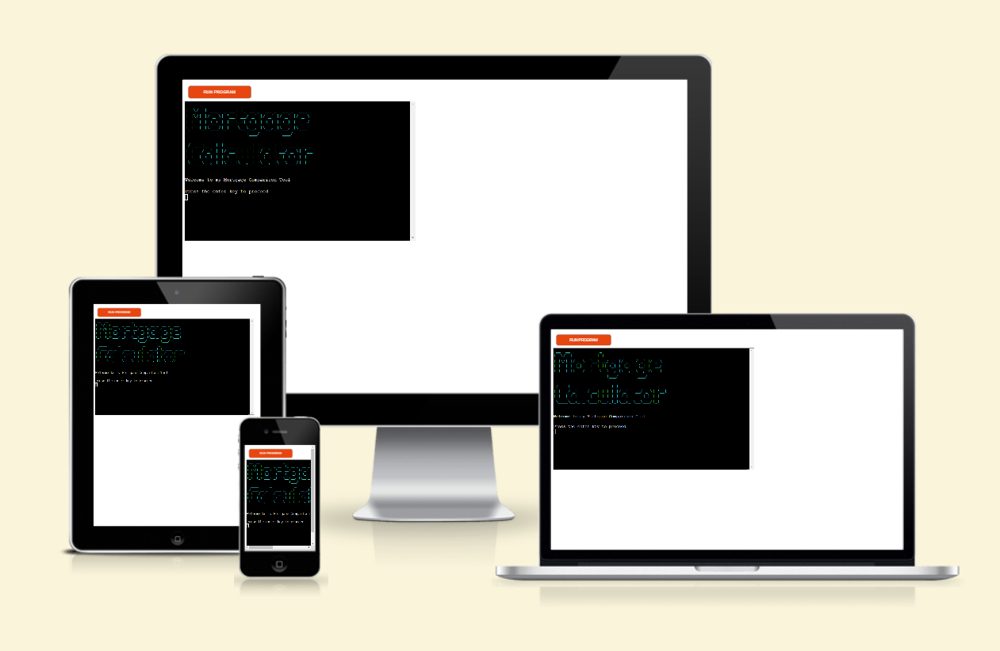
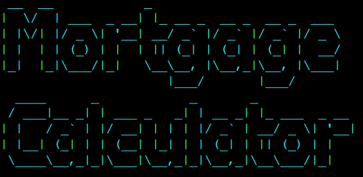
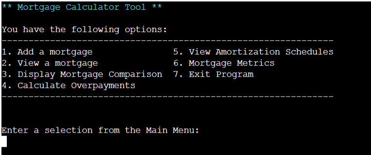
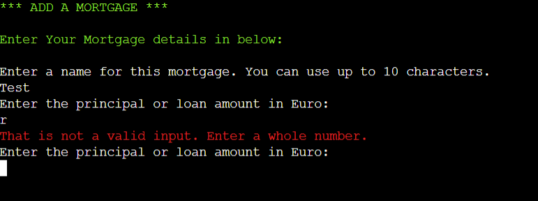
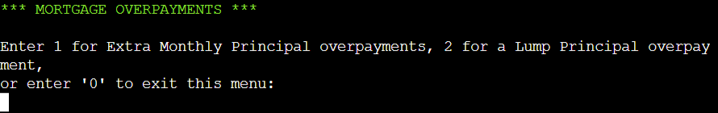

# Mortgage Comparison Tool
  

  [View Live Project Here](https://mortgage-comparison-tool-c884f78efc79.herokuapp.com/)

## Introduction
The Mortgage Comparison Tool is an interactive CL python application that allows user to calculate mortgage information such as monthly payments, lifetime interest on a loan, amortization schedules, and the effect of overpayments after inputing some basic mortgage information. User are allowed to save mortgages that they create for the session. 

## CONTENTS  
  
* [User Experience)](#user-experience)
  * [User Stories](#user-stories) 
* [Design](#design)
  * [Design](#design)
  * [Flowchart](#flowchart)
* [Features](#features)
  * [Logo](#logo)
  * [Menu](#menu)
  * [Input Validation](#input-validation)
  * [Add Mortgages](#add-mortgages)
  * [View Mortgages](#view-mortgages)
  * [Compare Mortgages](#compare-mortgages)  
  * [Overpayments](#overpayments)
  * [Amortization Schedule](#amortization-schedule)
  * [Mortgage-Data](#mortgage-data)
  * [Exit Program](#exit-program)
* [Future Features](#future-features)
* [Technologies](#technologies)
  * [Languages Used](#languages-used)
  * [Technologies and Programs Used](#technologies-and-programs-used)
  * [Deployment](#deployment)
* [Testing](#testing)
  * [Python Validation](#python-validation)
  * [Lighthouse Performance Audits via Chrome Dev Tools](#lighthouse-performace-audit-via-chrome-dev-tools)
  * [Manual Testing](#manual-testing)
  * [Bugs and Fixes](#bugs-and-fixes)
  * [Unfixed Bugs](#unfixed-bugs)
* [Credits](#credits) 

  
---   

## User Experience
The goal of this Mortgage Comparison tool is to allow the user an easy way to compare mortgages whether they are looking to purchase a home, refinance a home, or want to make overpayments on an existing loan. 
- ### Visitor Goal
  As a user, I want an easy way to view, compare, and manipulate potential mortgage scenarios to inform future financial decisions or goals.
- ### User stories
  1. User looking to purchase a home and wants to compare different mortgages by percentage rate, loan length, lifetime interest, and monthly payment.
  2. User looking to refinance a home and wanting to compare current loan data with new potential loans by loan length, monthly payment, and overall cost of the loan.
  3. User wanting to add a loan for comparison.
  4. User wanting to compare how monthly payments affects their loan.
  5. User wanting to compare how a lump principal affects their loan.
  6. User wanting to save loans they want to keep for comparison.
  7. User wanting to see the amortization schedule of a loan that they have entered. 

## Design
### Design 
  As a Python Command Line Interface application, design choices were limited. However, to make it easier for the user to interact with the application, I utilized a menu to help direct the user in options as well as color coding specific messages to lend definition to certain messages, error messages and to create distinctions between different information displayed.

### Flowchart
  Created in draw.io, the following flowchart provides a visualization of the planning process for this application. During the development of the application, it became apparent that additional inputs, functionality, and outputs were required for the implementation for some of the calculations required and to better organise the options in a way that made sense to the user.

  An example of this additional development is for principal overpayments. Originally, I had them as separate options. But based on initial user testing and feedback, I decided to combine them in the same menu option and allowing the user to select which type of overpayment they would make. This helped the organise the menu in a more logical way to the user.

  

  
Application Flowcart
  

  
  

## Features
### Logo

  

  
The Logo of the Mortgage Calculator is diplayed using ASCII. 

### Menu

A Main Menu displays to explain the options to the user. The User is given a reminder message that they can enter 0 at any juncture that prompts the user to make a main menu selection to view the menu. 

### Input Validation

When user input is required, input is validated to ensure that the input is within the parameters set. For example, if the user is required to input the APR (Annual Percentage Rate). The user is given an example of the format in the prompt and the input is validated as a float between 0 and 100. If the user inputs something that is not a number, a red error message is printed to the terminal stating the error and prompts the user to try again. If the user enters a number that is not within the paraments, in this case a negative numver or a number greater than 100, a red error message is printed to the terminal and the user is prompted again to input a valid input. 

### Add Mortgages

The user is allowed to add as many mortgages as they choose. Each mortgage is asked for user input for the name (or label) for the mortgage, principal amount, APR, and mortgage length. The monthly payment and lifetime interest is then calculated and printed on the terminal along with the mortgage inputs provided by the user. The user is then prompted to decide if they want to save this mortgage for their session. If the user chooses Yes, the mortgage is saved and the user is redirected back to the Main Menu options. If the user chooses not to save the mortgage, the user is redirected back to the Main Menu.

### View Mortgages

The user is allowed to view the details of any individual mortgage that they have saved during their session. If they selected the View Mortgage menu option, but have NOT entered in any mortgages, they will receive an error message and will be prompted to make a different choice from the main menu. If there are mortgages saved, the user is provided with a list of the available mortgages and they can enter in a mortgage number that corresponds with their saved mortgages to view the details for that individual mortgage. After the mortgage details are printed to the terminal, the user is prompted to choose a different mortgage to view or to return to the main menu and exit the View Mortgages section.

### Compare Mortgages

When the user has saved a minimum of two Mortgages, they can view a mortgage comparison table that displays the morgage name, principal amounts, APR, loan length, monthly payments, and lifetime interest. If the user has saved a minimum of two Mortgages, a red error message displays alerting them of the problem. The user can then select an option that allows them to create and save a Mortgage in the session. 

### Overpayments

  

  
There are two options in the Overpayments feature: 1) Additional Monthly Principal overpayments and 2) A Lump Principal Payment. Once this feature is selected, the user is required to choose which type of Overpayment they would like to calculate.

- ### Additional Monthly Principal Overpayment
  

  

  

  
  
  
  There are two options in the Overpayments feature: 1) Additional Monthly Principal overpayments and 2) A Lump Principal Payment. Once this feature is selected, the user is required to choose which type of Overpayment they would like to calculate.

### Amortization Schedule

  

  
In the event that the user navigates to non-existing page, a 404 page displays a Page not Found message and directs the user back to the main game page.

### Mortgage-Data
- A future feature would be allow for different levels or different numbers of tries to increase or decrease difficulty.
- A future feature would allow for different character groups to displayed depending on the level of difficulty.
- Also for future development, additional simple games featuring the characters. 

### Exit Program
- A future feature would be allow for different levels or different numbers of tries to increase or decrease difficulty.
- A future feature would allow for different character groups to displayed depending on the level of difficulty.
- Also for future development, additional simple games featuring the characters. 

## Technologies
  ### Languages Used
  - HTML5
  - CSS
  - Javascript

  ### Technologies and Programs Used
  - GitHub - used to save and store all the files for this website
  - GitHub Codespaces - was used as the IDE to develop and test the code for this website
  - Git - provided the version control
  - Adobe Photoshop 2024 - used to create wireframes and edit all the images
  - Wacom One: creative pen display and pen tablet
  - Google Docs - used for notes and documentation
  - Google Fonts - imported fonts from this website
  - Google Developer Tools - used to debug website and test for responsiveness
  - Google Lighthouse - used to audit the performance and quality of the website
  - WC3 HTML Validator - used to validate the HTML code
  - WC3 CSS Validator - used to validate the CSS code https://jigsaw.w3.org/css-validator/
  - JShint.com Javascript Validator - used to validate the Javascript code https://jshint.com/

  ### Deployment
  GitHub was used to deploy this website. The following steps were taken:

  1. Log into GitHub account.
  2. Navigate to the project repository: [Memory-game](https://github.com/hysinh/Memory-game?)
  3. Click on the Settings button on the horizontal navigation across the top portion of the page.
  4. Navigate to the Pages link under the Code and automation section on the left navigation.
  5. Under GitHub Pages, go to Build and deployment. Then, under Source, select "Deploy from a branch". 
  6. Next, under Branch, select "main" and "/root" and then click on the Save button.
  7. After a few moments, the website will be made live and the link will be made visible at the top of the page. 

  How to clone the Happy Cake Friends Memory Game & make changes:
  1. Open the [Memory-game repository](https://github.com/hysinh/Memory-game?) on GitHub.
  2. Navigate to the CODE link on the navigation across the top.
  3. Then, navigate to the green CODE button on the right side and click.
  4. Select the Local tab and click on the copy icon to make a copy of the repository.
  5. Then navigate back to your main GitHub dashboard and then create a new repository with your desired name.
  6. On the next page, navigate to the bottom of the page and select Import code under "Import code from another repository".
  7. In the next window, paste the copied link of the [Memory-game repository](https://github.com/hysinh/Memory-game?) into the line.
  8. Then, click Begin Import to import the repository code.
  9. Make changes and/or deploy as desired.

  ## Testing

  ### Validator Testing
  - #### HTML Validation
    No errors were returned when passing the official W3C HTML Validator
    

    
Index Page HTML Validation
  

    
    

    

    
404 Page HTML Validation
  

    
    

     
    
  - #### CSS Validation
    No errors were found when passing through the official W3C CSS Jigsaw validator
    

    
Index Page CSS Validation
  

    
    

    

    
404 Page CSS Validation
  

    
    

  - #### Javascript Validation
    No errors were found when passing through the JSHint Javascript validator
    

    
Javascript Validation
  

    
    

  
  - #### Lighthouse Performace Audit via Chrome Dev Tools
    Desktop Lighthouse Performance Audits
    

    
Index Page Lighthouse audit
  

    
    

    

    
404 Page Lighthouse audit
  

    
    

    
     

    Mobile Lighthouse Performance Audits
    

    
Index Page Lighthouse audit
  

    
    

    

    
404 Page Lighthouse audit
  

    
    

  ### Manual Testing
  Manual testing was performed on the website checking for broken links, content errors, and responsivity across different sizes. Testing took place during the build process using Dev Tools on Chrome and on the following real-world devices and browsers:

  #### Devices 
  1. Pixel 4XL
  2. Xiaomi 11T Pro
  3. Redmi Note 12 Pro+
  4. Lenovo IdeaPad Y500 Laptop
  5. Alienware Aurora R7 Desktop
  6. Microsoft Surface

  #### Browsers
  1. Microsoft Edge
  2. Brave
  3. Google Chrome
  4. Opera

  #### The results of testing are as follows:
  | Page | Test | Pass/Fail |
  | ---- | ---- | --------- |
  | Home  | Happy Tree Friends logo links back to the homepage | Pass |
  | Home  | Images and sections are responsive to different device sizes | Pass |
  | Home  | Play button works on click and sets the card grid correctly | Pass |
  | Home  | If the user clicks on a card, it flips to display the card. The card cannot be clicked to flip it back. | Pass |
  | Home  | If the user clicks on a second card, it flips to display the card. The two flipped cards are compared. If they match, the user is allowed to click on a new card. If they don't match, the cards will reset and the user can click on a new card (or one of the ones that didn't match). | Pass |
  | Home  | If the user find all the matches, the matches are validated and user receives a Win message. | Pass |
  | Home  | If the user exhausts their player tries before finding all the matches, the board is locked and the user receives a Lose message. | Pass |
  | Home  | If the user receives a Lose or Win message, when they click on the screen, the modal closes and they can reset the game if they choose. | Pass |
  | 404  | Page displays when user attempts to go to a non-existing page | Pass |
  | 404  | Link on the page bring user back to the home page | Pass |

  #### Bugs and Fixes
  | Bug | Page | Fix |
  | --- | ---- | --- |
  | Can still click on cards after lose game | Index page | Added a lockBoard function in JS file to resolve. |
  | Can still click on a third card when two first cards are being compared | Index page | Change < 2 in checkCards function to === 2 to prevent a third card from being flipped | 
  | When the user completes a game but lost, user can click several times on a card and it will eventually flip over | Index page | Added a lockBoard function to the checkLose function in JS file to resolve. |
  | Missing h2 close tag | Index page | Had changed an H1 tag to a H2 tag but did not update the close tag. Resolved by updating close tag. |
  | Section element | Index page | HTML validator suggested changing section element to div to eliminate issues with lack of heading. I changed the section element to a div element. |
  | Accessibility | Index page | Document doesn't use legible font sizes at the mobile size in the footer. The footer text size was adjusted to ensure better readability |
  | Invalid 'align' property | style.css | Removed align property  |
  | Unnecessary ; tags | script.js | I had put ; at the end of every function that was unncessary. Resolved by removing them. |
  | Missing ; tags | Script.js | Missing ; at the end of console.log in js file in two places. Added the ; as necessary. |
  

  ### Unfixed Bugs
  - At this time, because the cards all are added as elements to the DOM, it is possible to cheat by viewing the html source. You are able to see each image and it's names and it's location. I do not have enough programming knowledge at this time to avoid this.
  

## Credits
### Content
- Content for website was writing by myself
- Jason Holt Smith, https://github.com/bicarbon8, was available for copious amounts of assistance debugging and helping to steer me in the correct direction for writing the code.
- Grid layout https://developer.mozilla.org/en-US/docs/Web/CSS/CSS_grid_layout
- Modal code https://codepen.io/dantewebmaster/pen/Yabpmr
- W3C CSS Validator: https://jigsaw.w3.org/css-validator/
- How to randomize the array: The de-facto unbiased shuffle algorithm is the Fisher–Yates (aka Knuth) Shuffle. https://stackoverflow.com/questions/2450954/how-to-randomize-shuffle-a-javascript-array
- How to Make a Modal https://www.w3schools.com/howto/howto_css_modals.asp
- How to use docstrings in Javascript https://stackoverflow.com/questions/34205666/utilizing-docstrings
- Build Your Own Memory Card Game with HTML, CSS, and JavaScript - Beginner-Friendly Tutorial https://www.youtube.com/watch?v=xWdkt6KSirw
- Awesome Vanilla JavaScript Memory Card Game Tutorial https://www.youtube.com/watch?v=-tlb4tv4mC4
- How to toggle https://developer.mozilla.org/en-US/docs/Web/API/Element/classList & https://www.w3schools.com/howto/howto_js_toggle_class.asp
- How to stack div elements vertically https://stackoverflow.com/questions/19284923/how-do-i-automatically-stack-divs-vertically-inside-a-parent
- How to remove a class from an element https://www.w3schools.com/howto/howto_js_remove_class.asp
- How to set multiple conditions in an if statement in JavaScript https://www.shecodes.io/athena/132703-how-to-set-multiple-conditions-in-an-if-statement-in-javascript#:~:text=In%20JavaScript%2C%20you%20can%20set

### Media
- Artwork was created by myself on Adope Photoshop
- The Happy Cake Friends characters were created by my daughter, Liloux Smith. They were redrawn in Adobe Photoshop for the purposes of this project.